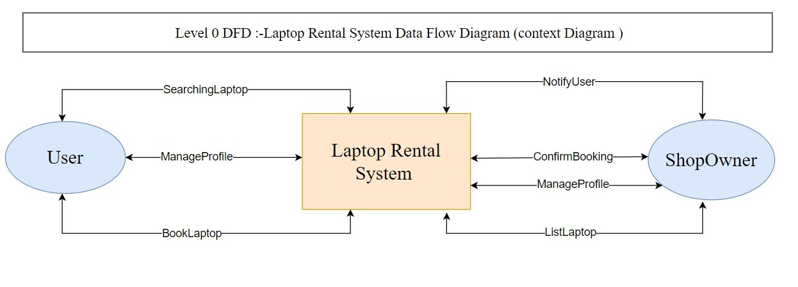
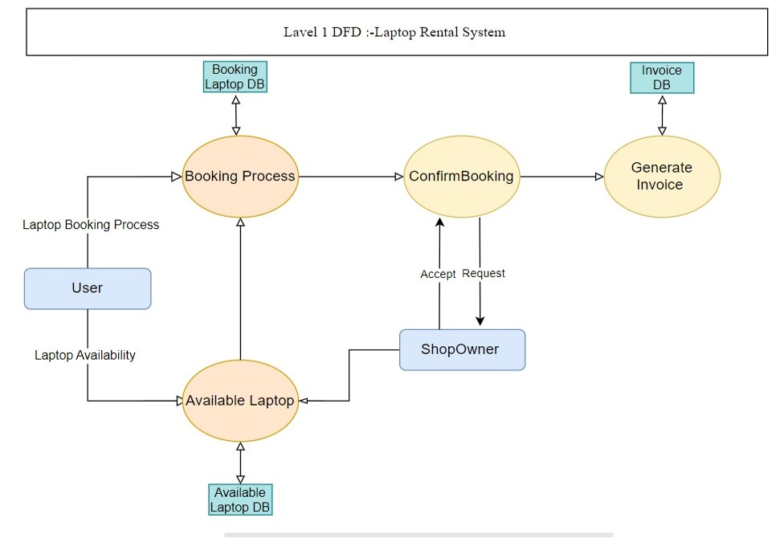
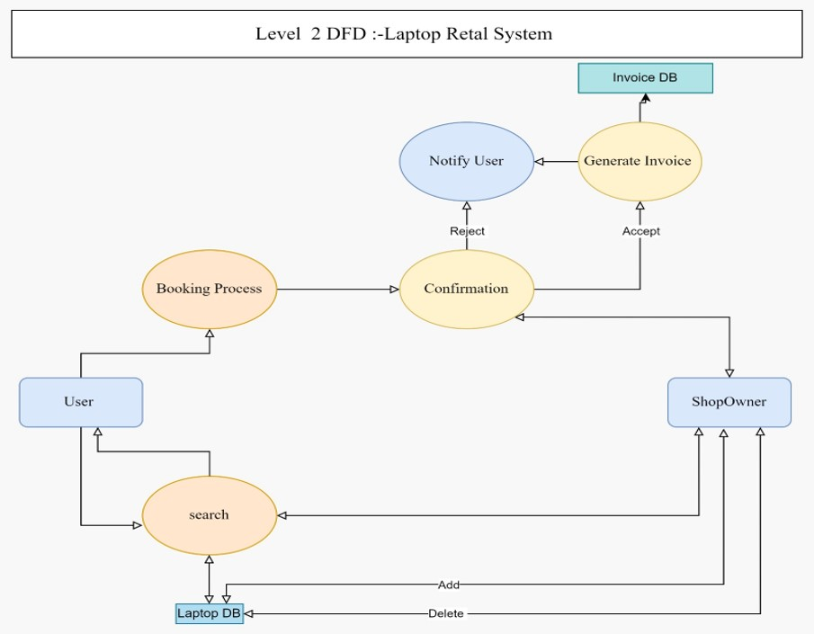
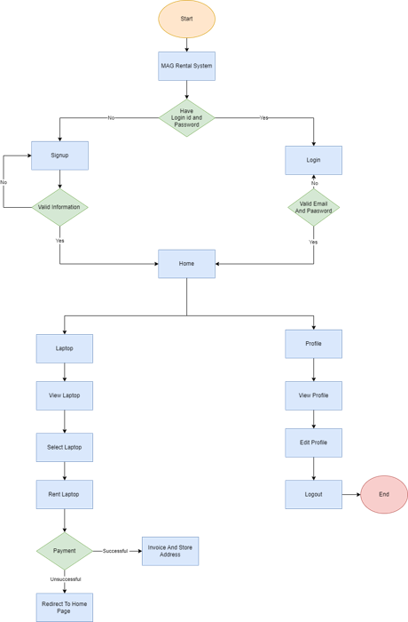
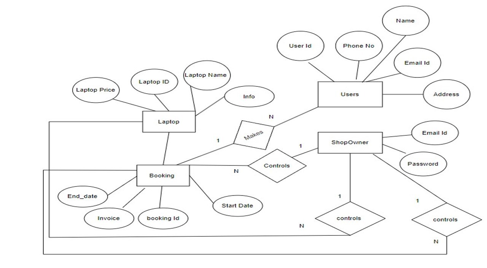
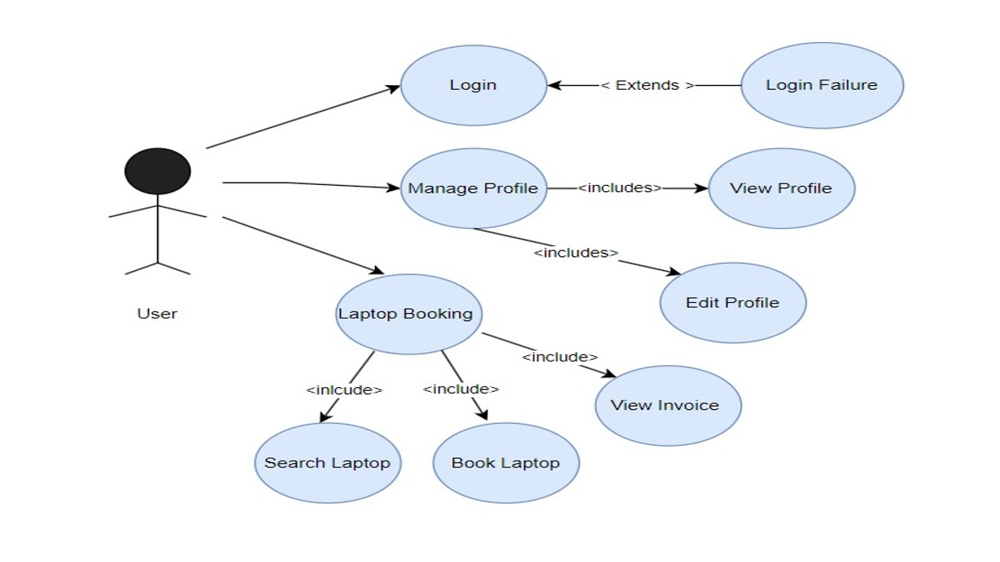

# Laptop Rental System

## Overview
The Laptop Rental System is an educational project designed to explore and apply concepts of React and Firebase. This web application simulates a platform for renting laptops, providing hands-on experience with modern web development technologies.

## Project Purpose
The primary goal of this project is to learn and demonstrate proficiency in:
- React for building user interfaces
- Firebase for backend services and real-time database management
- Google Maps API integration for location-based features

## Features Implemented for Learning
- User Authentication (using Firebase Authentication)
- CRUD operations with Firebase Realtime Database
- React component structure and state management
- Integration of external APIs (Google Maps)
- Responsive design principles

## Technology Stack
- Frontend: React
- Backend: Firebase
- Maps Integration: Google Maps API

## Installation
1. Clone the repository
2. Install dependencies: `npm install`
3. Set up a Firebase project and add configuration to the app
4. Obtain a Google Maps API key and add it to the project
5. Run the application: `npm start`

## Usage
This project demonstrates:
1. User registration and login flow
2. Browsing a list of sample laptops
3. Simulated booking process
4. Basic location features using Google Maps

## Learning Outcomes
Through this project, we gained experience in:
- Setting up a React project structure
- Managing state in a React application
- Integrating Firebase for backend functionality
- Implementing user authentication
- Working with external APIs in a React environment

## Future Learning Goals
- Implement more advanced React patterns
- Explore Firebase Cloud Functions
- Enhance state management with Redux or Context API
- Improve testing coverage with React Testing Library

## Contributing
This is an educational project, but we welcome suggestions for improvement or discussions about the implemented concepts.

## Diagrams

npm install -g npm@latest
npm cache clean -f
npm install --force
npm install --legacy-peer-deps
npm install
